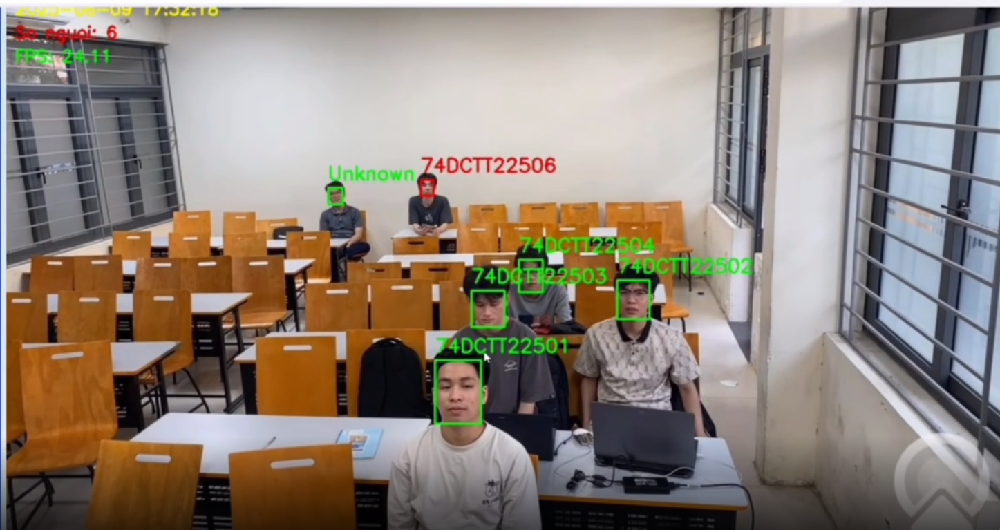

# Hệ thống điểm danh tự động bằng khuôn mặt theo thời gian thực

Ứng dụng web hỗ trợ điểm danh sinh viên bằng nhận diện khuôn mặt từ webcam. Hệ thống cho phép đăng ký ảnh khuôn mặt, quản lý thời khóa biểu, nhận diện trong thời gian thực và lưu kết quả điểm danh vào SQLite.

Phiên bản ứng dụng web nằm tại thư mục `nhandien_khuonmat-main`.

## Chức năng chính

- Đăng ký ảnh khuôn mặt sinh viên và tạo dữ liệu embedding.
- Quản lý lớp học, môn học, thời khóa biểu và danh sách sinh viên.
- Nhận diện khuôn mặt trực tiếp từ webcam.
- Tự động cập nhật trạng thái có mặt cho sinh viên thuộc lớp đang chọn.
- Xem các buổi đã điểm danh theo lớp và môn học.
- Lưu kết quả điểm danh kèm thời gian vào cơ sở dữ liệu SQLite.

## Luồng nhận diện và các mô hình

Web backend khởi tạo `FaceAnalysis(name="buffalo_l")` trong `backend/face_register.py` và `backend/opencv_with_queue.py`. Vì vậy hệ thống không chỉ gọi một hàm nhận diện có sẵn: nó kết hợp phát hiện khuôn mặt, chuẩn hóa đặc trưng và đối sánh embedding để quyết định điểm danh.

```text
Webcam
  │  khung hình 640 × 480 (xử lý mỗi 5 khung hình)
  ▼
RetinaFace-10GF: phát hiện mặt + bounding box + landmark
  ▼
Căn chỉnh/chuẩn hóa khuôn mặt
  ▼
ResNet-50 + ArcFace: embedding 512 chiều đã L2-normalize
  ▼
Cosine similarity với face_embeddings.pkl (ngưỡng hiện tại: 0.5)
  ▼
Kiểm tra sinh viên thuộc lớp đang chọn → cập nhật có mặt
  ▼
Khung hình có nhãn → MJPEG `/stream` → giao diện web
```

Khi đăng ký ảnh, `face_register.py` lấy embedding chuẩn hóa từ khuôn mặt đầu tiên tìm thấy trong mỗi ảnh và lưu vào `face_embeddings.pkl`. Khi điểm danh, `opencv_with_queue.py` chọn embedding có tích vô hướng lớn nhất với dữ liệu đã lưu; vì các embedding đều chuẩn hóa, phép tính này chính là cosine similarity. Kết quả dưới ngưỡng được gán là `Unknown`.

| Thành phần | Vai trò | Tình trạng trong dự án |
| --- | --- | --- |
| RetinaFace-10GF | Phát hiện nhiều khuôn mặt, hồi quy bounding box và landmark để hỗ trợ căn chỉnh. | Detector trong gói `buffalo_l` mà web backend sử dụng. |
| ResNet-50 / iResNet-50 | Backbone trích xuất đặc trưng khuôn mặt. `buffalo_l` đi kèm recognition model ResNet-50 huấn luyện trên WebFace600K. | Đang tạo embedding trong web app; `Demo_face_detection/iresnet.py` cũng có iResNet-50 để huấn luyện thử nghiệm. |
| ArcFace | Không phải detector mà là loss margin góc khi huấn luyện recognition model; làm embedding cùng người gần nhau và khác người xa nhau trên không gian cosine. | Web app dùng embedding từ model nhận dạng đã huấn luyện theo hướng ArcFace; `ArcFace_Loss.py` và `train_face_recog.py` minh họa cách huấn luyện embedding 512 chiều. |
| ResNet-100 / iResNet-100 | Backbone sâu hơn, thường đổi thêm chi phí suy luận lấy khả năng phân biệt tốt hơn. | Có trong các thử nghiệm, chưa được nối vào luồng web mặc định. |

### RetinaFace với ResNet-50 và ResNet-100

RetinaFace là mạng **phát hiện** khuôn mặt, không nhận danh tính. Backbone như ResNet-50 trích xuất feature map đa tỉ lệ; FPN kết hợp các feature map, SSH tăng ngữ cảnh, sau đó ba head dự đoán mặt/nền, bounding box và 5 landmark. Mã `insightface/Demo_face_detection/models/retinaface.py` có cấu hình `cfg_re50` cho RetinaFace dùng ResNet-50.

Các file `retinaface.py`, `retinaface_custom_detect.py` và `visualize.py` trong `insightface/Demo_face_detection` còn minh họa RetinaFace với backbone ResNet-100 tự dựng. Đây là phần thử nghiệm kiến trúc/feature map; để dùng trong thực tế cần trọng số tương thích, giải mã anchor và NMS đầy đủ. Nó không thay thế detector `buffalo_l` của web app hiện tại.

### ArcFace với iResNet-50 và iResNet-100

Nhánh nhận dạng nhận khuôn mặt đã căn chỉnh và xuất embedding 512 chiều. Trong `train_face_recog.py`, backbone mặc định là `iresnet50`; lớp `ArcFace` chuẩn hóa embedding và trọng số lớp, thêm angular margin rồi tối ưu bằng cross-entropy. `iresnet100` cũng đã được định nghĩa trong `iresnet.py`, nhưng cần tự huấn luyện, đánh giá và cập nhật mã suy luận nếu muốn chuyển sang dùng nó.

Tóm lại: **RetinaFace tìm khuôn mặt và landmark; ResNet/iResNet biến khuôn mặt thành embedding; ArcFace là cách huấn luyện embedding có tính phân biệt; cosine similarity quyết định danh tính lúc điểm danh.**

## Minh họa giao diện

### Nhận diện khuôn mặt theo thời gian thực



## Kiến trúc và công nghệ

```text
Giao diện HTML CSS JavaScript
              |
           Flask API
              |
OpenCV và InsightFace buffalo_l
  ├── RetinaFace-10GF (detection và landmark)
  └── ResNet-50, embedding ArcFace
              |
     SQLite và dữ liệu embedding
```

- Frontend: HTML, CSS, JavaScript, Bootstrap.
- Backend: Python, Flask, Flask-CORS.
- Nhận diện khuôn mặt: OpenCV và InsightFace `buffalo_l` (RetinaFace-10GF cho detection/landmark, ResNet-50 cho recognition embedding theo ArcFace).
- Cơ sở dữ liệu: SQLite.
- Truyền video: luồng MJPEG qua endpoint `/stream`.

## Cấu trúc thư mục

```text
AI_FaceDetection/
  nhandien_khuonmat-main/
    Frontend/                     # Giao diện web
    backend/
      flask_stream.py             # Flask API và endpoint MJPEG
      face_register.py            # Tạo embedding từ ảnh đăng ký
      opencv_with_queue.py        # Webcam, suy luận và đối sánh embedding
      dtb.db                      # SQLite
      face_embeddings.pkl         # Embedding đã đăng ký (tạo sau khi đăng ký ảnh)
    dataset/                      # Ảnh khuôn mặt đăng ký
    docs/images/                  # Ảnh minh họa cho README
    opencv_on_web.py              # Mã thử nghiệm xử lý video
  insightface/
    Demo_face_detection/          # Thử nghiệm RetinaFace, iResNet và ArcFace
  README.md
```

## Cài đặt

Yêu cầu: Python 3.10 hoặc 3.11, webcam và kết nối Internet trong lần chạy đầu để InsightFace tải mô hình `buffalo_l` nếu máy chưa có.

```powershell
cd nhandien_khuonmat-main
python -m venv .venv
.\.venv\Scripts\Activate.ps1
python -m pip install --upgrade pip
pip install flask flask-cors werkzeug opencv-python numpy insightface onnxruntime
```

Nếu sử dụng GPU NVIDIA tương thích, có thể thay `onnxruntime` bằng `onnxruntime-gpu`.

Các thử nghiệm huấn luyện RetinaFace/ArcFace trong `insightface/Demo_face_detection` cần thêm PyTorch, torchvision và dữ liệu huấn luyện; chúng không phải điều kiện để chạy web app mặc định.

## Chạy ứng dụng web

```powershell
cd nhandien_khuonmat-main\backend
python flask_stream.py
```

Mở trình duyệt tại `http://localhost:5000`.

Mã hiện tại cấu hình `CUDAExecutionProvider` và mở webcam có chỉ số `1` trong `backend/opencv_with_queue.py`. Khi chạy trên CPU hoặc dùng webcam mặc định, hãy đổi provider phù hợp và thay `cv2.VideoCapture(1)` thành chỉ số camera đúng của máy, thường là `0`.

## Quy trình sử dụng

1. Mở giao diện web và tải ảnh cho từng sinh viên cùng mã sinh viên.
2. Hệ thống chạy `face_register.py` để phát hiện/căn chỉnh khuôn mặt, trích xuất embedding và lưu vào `face_embeddings.pkl`.
3. Chọn lớp học, môn học và buổi học từ thời khóa biểu.
4. Bắt đầu luồng webcam; backend tạo embedding cho các mặt phát hiện được, đối sánh với dữ liệu đăng ký và đánh dấu có mặt nếu thuộc lớp đang chọn.
5. Lưu danh sách điểm danh để ghi các bản ghi vào bảng `Attendance` trong SQLite.

## Một số API chính

| Endpoint | Phương thức | Mục đích |
| --- | --- | --- |
| `/api/upload` | `POST` | Tải ảnh sinh viên và cập nhật embedding |
| `/api/schedule` | `GET` | Lấy thời khóa biểu |
| `/api/class/<class_id>/students` | `GET` | Lấy sinh viên của lớp |
| `/api/start_stream` | `POST` | Khởi động nhận diện từ webcam |
| `/stream` | `GET` | Trả luồng MJPEG đã xử lý |
| `/api/recognize` | `POST` | Lấy danh sách khuôn mặt đã nhận diện |
| `/api/save_attendance` | `POST` | Lưu kết quả điểm danh |

## Dữ liệu, giới hạn và quyền riêng tư

Ngưỡng 0.5 là giá trị hiện tại trong mã, không phải ngưỡng đúng cho mọi môi trường. Nên hiệu chỉnh bằng ảnh thật của lớp học, kiểm tra cả false accept và false reject trước khi dùng làm căn cứ điểm danh. Chất lượng ảnh đăng ký, ánh sáng, góc mặt, che khuất và hiệu năng máy đều ảnh hưởng kết quả.

Thư mục `dataset`, tệp `face_embeddings.pkl`, cơ sở dữ liệu SQLite và ảnh minh họa có thể chứa dữ liệu nhận dạng cá nhân. Trước khi đưa kho mã nguồn lên GitHub công khai, chỉ giữ dữ liệu mẫu đã được phép sử dụng hoặc đã ẩn danh; không công khai ảnh khuôn mặt, mã sinh viên hay kết quả điểm danh thực tế khi chưa có sự đồng ý phù hợp.
